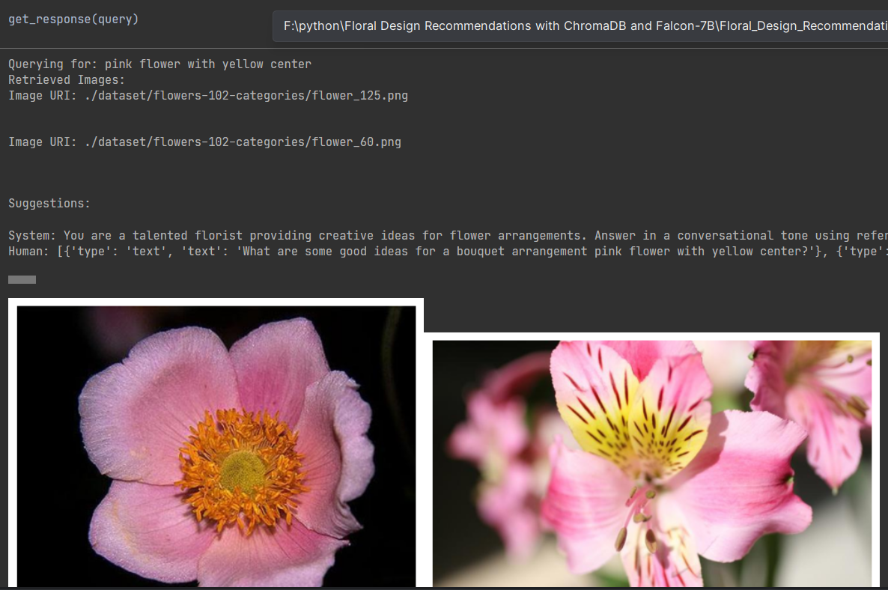

# Floral Design Recommendations with ChromaDB and Falcon-7B

## Overview

The "Floral Design Recommendations with ChromaDB and Falcon-7B" project leverages advanced AI tools and databases to
provide design suggestions based on floral images and user queries. By utilizing ChromaDB for managing image data and
Falcon-7B for processing natural language, the system generates tailored recommendations for floral designs.

## Example of the system:

pink flower with yellow center

## Key Features

- **ChromaDB Integration**: Manages and stores floral image data for easy retrieval and analysis.
- **Falcon-7B Model**: A powerful language model used to interpret user queries and generate design recommendations.
- **Image Encoding**: Images are processed, encoded, and integrated into the query, enabling a seamless experience.
- **Query Processing**: User queries are handled to ensure the system works within token limits for optimal results.

## Workflow

1. **Image Handling**: Floral images are inputted, encoded, and prepared for processing.
2. **User Query**: Users provide a query related to floral design preferences.
3. **Recommendation Generation**: The system processes the query, checks token limits, and generates personalized
   recommendations.
4. **Output**: Floral design suggestions are presented to the user based on the analysis of the images and query.

## Requirements

- **ChromaDB**: Database for managing floral images.
- **Falcon-7B**: Language model for processing and generating recommendations.
- **Base64 Encoding**: Image data is encoded to fit within token limits.

## Usage

The system accepts floral image inputs and user queries, processes them, and outputs tailored floral design
recommendations. It ensures that token limits are respected and generates suggestions accordingly.

## Future Improvements

- Expand the database with more floral images and design patterns.
- Enhance the user interface for easier query submissions.
- Implement real-time feedback for design recommendations.

Note that I run this on google colab, and the path of the data might be slightly different.

